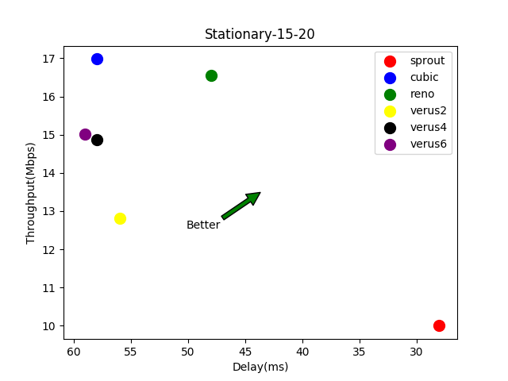
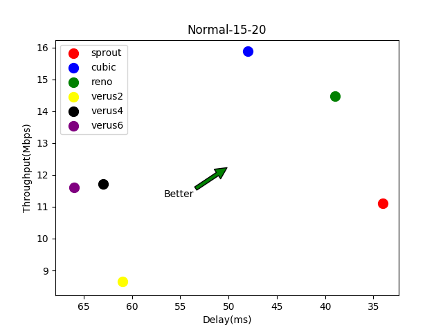
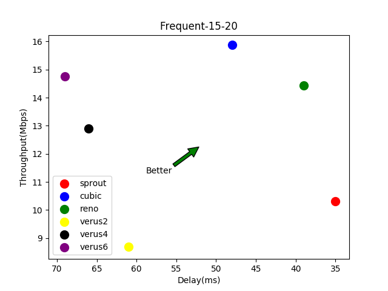

# Setup to run Sprout and Verus with Mahimahi

> see [Installation-Guide](INSTALL.md) for setup

> Utility plots can be found in [plots](plots) directory

> scripts to calculate utility can be found in [scripts](scripts/analysis/utility.py)

## Plots

## Utility Functions

To calculate the utilities for each protocol, time has been divided into
bins of size 5ms.

Following are the utility functions used for our graphs.

Here, __*t*__ = throughput and __*d*__ = delay

### Utility Function 1

**Remy Congestion Control Algorithm**

U(t, d) = log(t) - delta * log(d)

where delta = 0.001 (value can be adjusted)

### Utility Function 2

**PCC Vivace Congestion Control**

U(t, d) = t^a - b * t * d(d)/dt

d(d)/dt = Delay Gradient i.e. change in delay experienced from last bin

where a = 1, b = 0.1 (values can be adjusted)

### Utility Function 3

**Congestion Control for Future Mobile Networks**

U(t, d) = t * (1 - pRTT)

pRTT = 5 * 10^-4 * |avg_dealy - min_delay| (penalty for latency)
